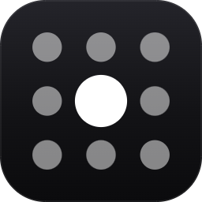

<div align="center">



# SickRGB

**RGB lighting for Windows that treats every device you own as lights in one shared space.**

Effects travel across your desk by real distance: a click on your mouse ripples outward and
reaches your keyboard before it reaches your case.

[](#install)
[](#install)
[](#install)

</div>

---

## What makes it different

Most RGB software animates each device on its own, so a "wave" is really several unrelated
waves that happen to run at the same time.

SickRGB gives every light a real position, in millimetres, on a shared canvas. Drag your
devices on the **Layout** page to match how they actually sit on your desk. Effects are then
written as functions of *position and time*:

- Click your mouse → a ripple expands from **the mouse**, hitting the keyboard first and the
  case later, because the case is further away.
- Press a key → the wave starts at that key's position and spreads outward from there.
- Move a device on the canvas and the timing changes immediately, because the distance did.

Nothing is faked with per-device delays. Arrival time is just distance ÷ speed.

---

## Install

1. Download **`SickRGB.exe`** from the [latest release](../../releases/latest).
2. Run it.

That's it. It's a single file with the .NET runtime bundled: nothing to install, no
administrator rights, nothing written outside your own user folder.

> **Using a Turtle Beach or ROCCAT keyboard?** Close its own software (Swarm II) first. It
> runs a background lighting thread that will fight for control of the keyboard.

Settings live in `%AppData%\SickRGB\settings.json`.

### Adding your other devices

Out of the box, SickRGB drives supported keyboards and mice directly. For memory,
motherboards, graphics cards, coolers and case fans it bridges to
[OpenRGB](https://openrgb.org/).

Click **Add more lights** in the sidebar. It downloads OpenRGB, starts it out of the way, and
connects. You don't need to configure anything yourself. Memory and most motherboards also
need a driver and administrator rights; the wizard explains and offers both, and nothing is
installed without you clicking it.

---

## Effects

| Effect | Reacts to input | |
|---|:--:|---|
| **Static** | | One colour everywhere |
| **Palette** | | Five colours across your layout |
| **Gradient** | | Two colours at any angle |
| **Breathing** | | Everything fades in and out together |
| **Rainbow Cycle** | | The spectrum, in step |
| **Colour Wave** | | A rainbow drifting across your layout |
| **Ripple** | ● | A ring spreading out from each key press or click |
| **Reactive Wave** | ● | A broad wave rolling outward |
| **Reactive Flash** | ● | The nearest lights flare, then fade |
| **Activity Heat** | ● | Warms where you work, cools when you stop |
| **Screen Ambient** | | Each light matches its part of your screen |

Set one effect for everything, or give any device its own from the **Devices** page. Either
way they share the same canvas, so the result stays spatially coherent.

---

## About watching your typing

Four effects need to know when you press a key or click, which means a system-wide input
hook, the same mechanism a keylogger uses. Because that deserves a straight answer:

- The hook is installed **only while a reactive effect is running**, and removed the moment
  you pick another.
- A key press is turned into a **position on the keyboard** inside the hook callback and then
  dropped. Which key you pressed never leaves that callback.
- Clicks carry **nothing at all**: not the button, not the cursor position.
- Nothing is stored, written to disk, or transmitted. The only network connection the app
  makes is to OpenRGB on your own machine, and only if you set that up.
- Every event is passed straight on. Input is observed, never intercepted or altered.

Both hooks are short and worth reading for yourself:
[`KeyboardHook.cs`](src/SickRGB/Input/KeyboardHook.cs) ·
[`MouseHook.cs`](src/SickRGB/Input/MouseHook.cs)

---

## Building from source

**Requires:** the [.NET 8 SDK](https://dotnet.microsoft.com/download/dotnet/8.0) and Windows.

```powershell
git clone https://github.com/davidnoeee/sickrgb.git
cd sickrgb

.\build.ps1              # build and run
.\build.ps1 -Publish     # produce dist\SickRGB.exe
```

Or with plain `dotnet`:

```powershell
dotnet build src\SickRGB\SickRGB.csproj -c Release
dotnet run   --project src\SickRGB\SickRGB.csproj
```

No admin rights are needed to build or run. If you don't want to install the SDK
system-wide, the official
[`dotnet-install.ps1`](https://learn.microsoft.com/dotnet/core/tools/dotnet-install-script)
script installs it into your user folder.

---

## Contributing

Contributions are welcome, especially **support for more hardware**.

Adding a device means writing a single small class. The effect engine, the canvas and the UI
never need to know it exists. See [CONTRIBUTING.md](CONTRIBUTING.md) for a walkthrough,
the project layout, and the house style.

Good first issues:

- A native driver for a keyboard or mouse you own
- More effects (they're pure functions of position and time; see `EffectLibrary.cs`)
- Better default device shapes and canvas placement
- Anything in the issue tracker

---

## Hardware notes

The Turtle Beach Magma protocol was reverse-engineered from scratch and verified against real
hardware. If you're interested in how, or want to support a similar device,
[PROTOCOL.md](PROTOCOL.md) documents the whole thing: the HID topology, the handshake, the
packet layout, and the checksum.

Short version: Turtle Beach re-badged the ROCCAT Magma and changed its USB ID from
`1E7D:3124` to `10F5:5024`. OpenRGB has the ROCCAT one in its device table but not the Turtle
Beach one, so it never claims the keyboard, even though the protocol is byte-for-byte
identical.

---

## Licence

See [LICENSE](LICENSE).
